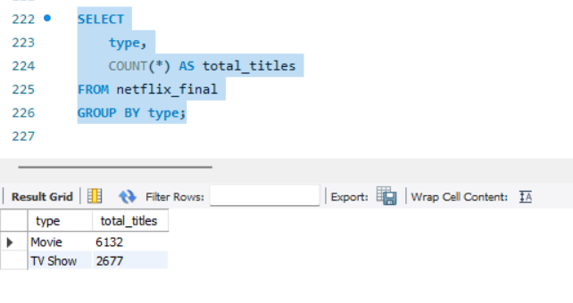
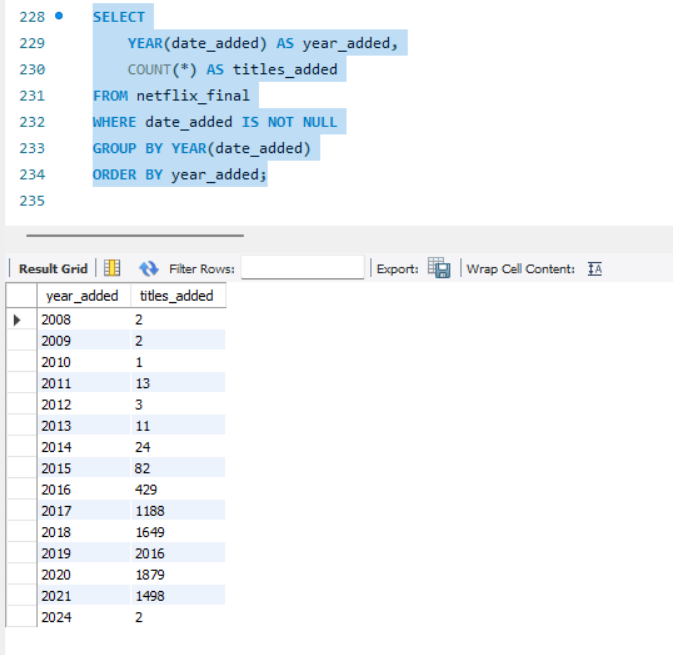
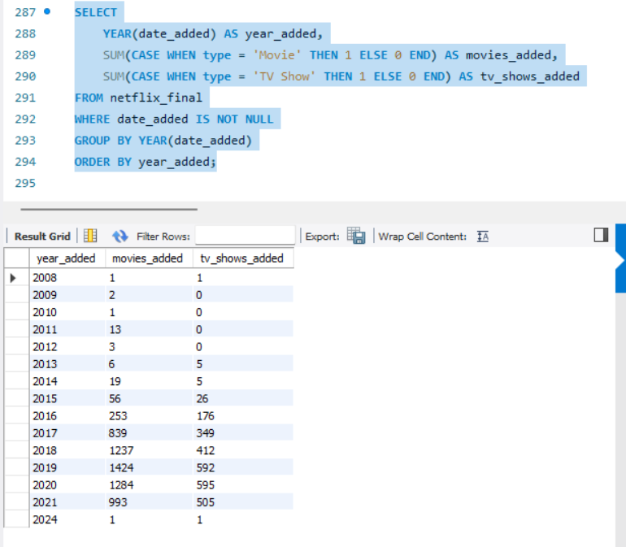
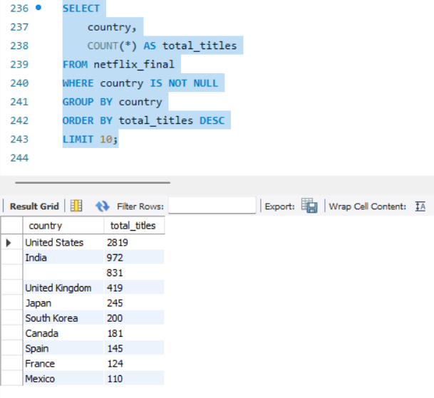
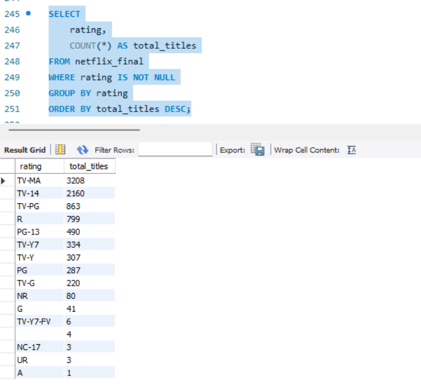
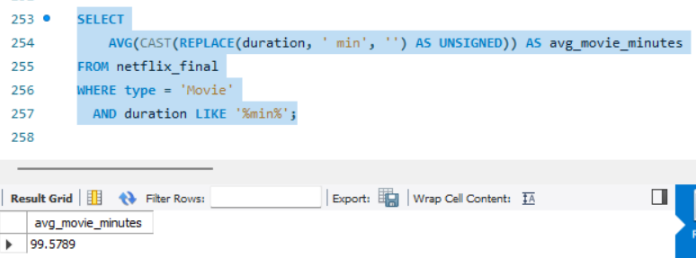
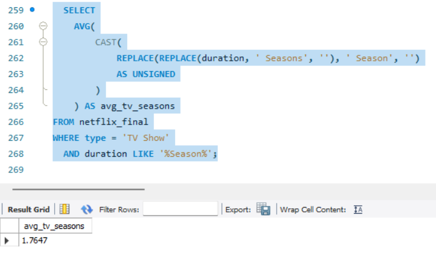
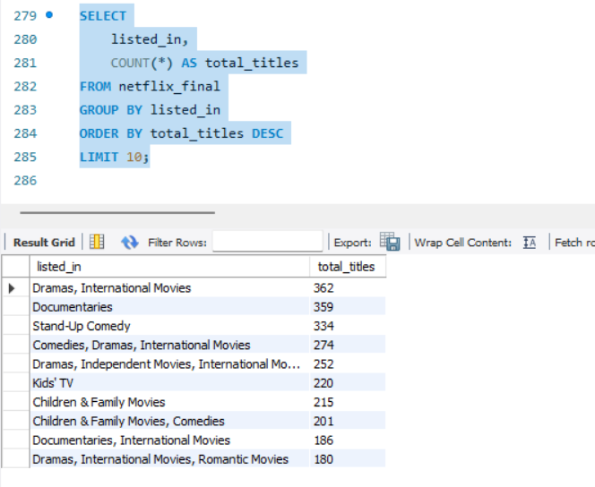
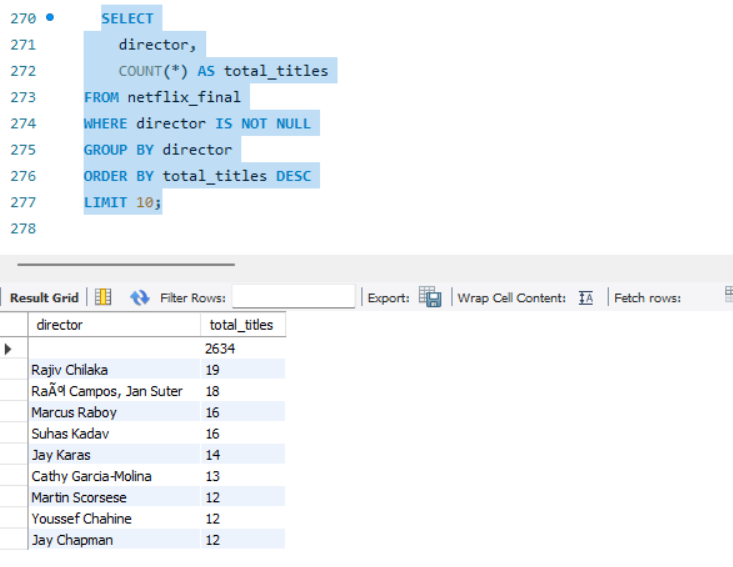
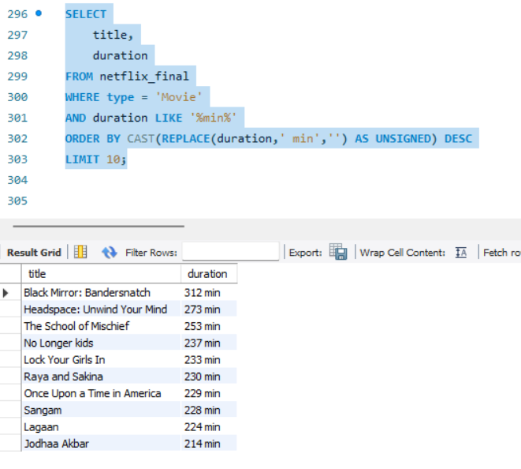

# Netflix Movies and TV Shows - SQL Analysis

## Project Overview

This project analyzes the **Netflix Movies and TV Shows dataset** using SQL.

The analysis focuses on:

- Data cleaning
- Handling inconsistent date formats
- Detecting and fixing data quality issues
- Exploratory data analysis
- Advanced SQL queries

Dataset Source:
https://www.kaggle.com/datasets/rahulvyasm/netflix-movies-and-tv-shows

---

# Database Workflow

The project follows a simple data pipeline:

Raw Dataset
→ netflix_titles

Cleaned Dataset
→ netflix_cleaned

Final Analysis Table
→ netflix_final

---

# Dataset Size

Total Titles:

8809

---

# Key Insights

- The Netflix catalog contains **6132 Movies and 2677 TV Shows**, showing a strong dominance of movie content.

- Netflix experienced its **largest catalog growth between 2017 and 2020**, when thousands of titles were added.

- The **United States** is the largest content producer on Netflix, followed by **India** and the **United Kingdom**.

- The most common content rating is **TV-MA**, indicating a strong focus on mature audiences.

- The most frequent genre combination is **Dramas, International Movies**, followed by **Documentaries** and **Stand-Up Comedy**.

- The **average movie duration is approximately 99.6 minutes**.

- Netflix TV shows average **1.76 seasons**, suggesting that many titles are limited series.

- A small number of **data quality issues were detected and corrected**, including inconsistent date formats and misplaced duration values in the rating column.

# Content Distribution

Movies vs TV Shows

Movies dominate the Netflix catalog with **6132 titles**, while **TV Shows account for 2677 titles**.

---

# Netflix Catalog Growth

Netflix significantly expanded its catalog between **2017 and 2020**, reflecting rapid platform growth.

---

# Movies vs TV Shows Added Per Year

Movies consistently dominate yearly additions, but TV shows increased significantly after 2016.

---

# Top Producing Countries

The **United States** produces the largest amount of Netflix content, followed by **India** and the **United Kingdom**.

---

# Rating Distribution

The most common rating is **TV-MA**, indicating a strong focus on mature audiences.

---

# Average Movie Duration

The average movie duration on Netflix is approximately **99.6 minutes**.

---

# Average TV Show Seasons

Netflix TV shows have an average of **1.76 seasons**, suggesting many limited series.

---

# Genre Distribution

The most common genre combination is **Dramas, International Movies**, followed by **Documentaries** and **Stand-Up Comedy**.

---

# Top Directors

Several directors contribute multiple titles to the Netflix catalog, with **Rajiv Chilaka** having the highest count.

---

# Longest Movies on Netflix

Some titles exceed **300 minutes**, such as *Black Mirror: Bandersnatch*.

---

# SQL Skills Demonstrated

This project demonstrates:

- Data Cleaning
- Handling mixed date formats
- Data Quality Checks
- Aggregations
- CASE statements
- String manipulation
- Advanced filtering
- Analytical queries

---

# Project Structure
netflix-sql-analysis

data/
sql/
01_create_database_and_table.sql
02_load_data.sql
03_data_cleaning.sql
04_exploratory_analysis.sql
05_advanced_analysis.sql

images/

README.md

# Author

**Anastasios Saliaris**

SQL Data Analysis Project
